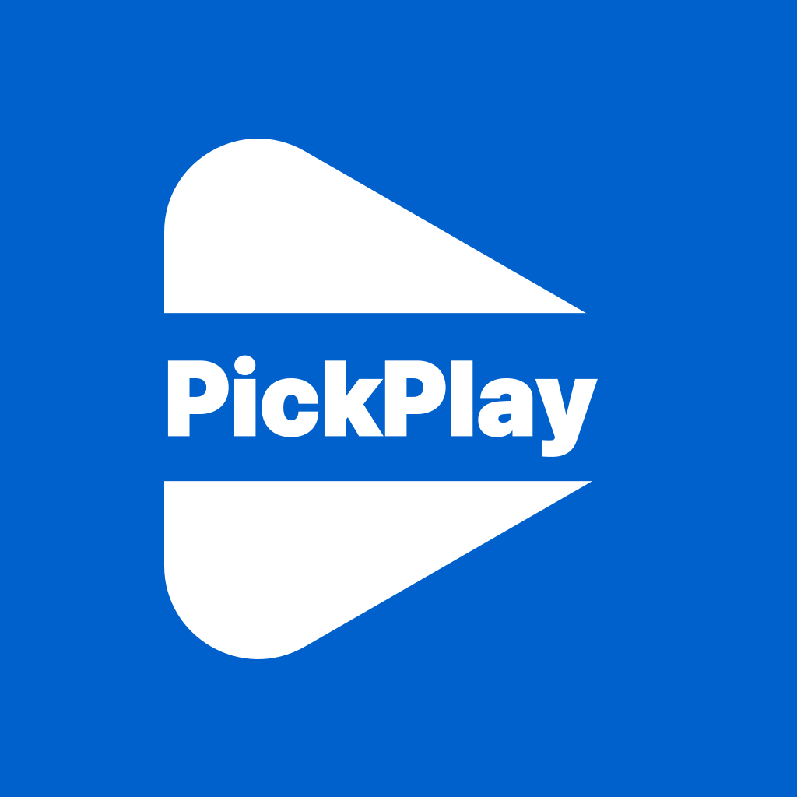

# 🎯 픽플레이 (PickPlay)

**매일 새로운 밸런스 게임으로 포인트를 모으세요!**

## 🌟 앱 소개

픽플레이는 매일 새로운 **밸런스 게임** 질문에 참여하고 포인트를 받는 재미있는 앱입니다!  
나만의 질문을 만들고, 선택을 통해 나만의 **애니마코드**를 깨워보세요!

### 🎮 어떻게 플레이하나요?

1. **매일 새로운 질문** - A 또는 B 중 하나를 선택하세요
2. **광고 시청** - 포인트를 받기 위해 리워드 광고를 보세요  
3. **포인트 획득** - 다수 5P, 소수 10P를 받으세요
4. **연속 참여** - 매일 참여하면 더 많은 포인트!
5. **라이브픽 참여** - 다른 유저들이 만든 질문에 참여하고 사다리 게임으로 보상을 받으세요!
6. **나만의 질문 만들기** - 10P로 나만의 밸런스 게임 질문을 만들어보세요!

### 💎 주요 특징

- 🎯 **매일 새로운 밸런스 질문**
- 🏆 **다수/소수 보상 시스템** (5P/10P)
- 🔥 **연속 참여 보너스** (10일째부터 2배, 20일째부터 3배)
- 📊 **실시간 전국 결과 확인**
- 🎁 **리워드 광고로 포인트 적립**
- 🎲 **라이브픽** - 유저가 만든 질문에 참여하고 사다리 게임으로 10P~300P 획득!
- 🎨 **애니마코드** - 30번의 선택으로 나만의 캐릭터를 깨우고, 계속 진화시켜보세요!
- 🎓 **튜토리얼** - 처음 시작하는 유저를 위한 친절한 가이드와 500P 보상!

## 📱 다운로드

### iOS

### Android  

## 🎯 예시 질문

### 메인 질문
> **"오늘 저녁에 뭐 하실 건가요?"**
> - A) 집에서 넷플릭스 보기
> - B) 친구들과 외식하기

> **"새로운 휴대폰을 산다면?"**
> - A) 최신 플래그십 모델
> - B) 합리적인 가격의 중급형

### 라이브픽 (유저가 만든 질문)
- **일상**: "주말에 뭐 하실 건가요?" / "아침에 일어나면?"
- **연애**: "고백할 때는?" / "이상형은?"
- **가치관**: "돈 vs 시간" / "안정 vs 도전"
- **엔터테인먼트**: "영화 vs 드라마" / "K-pop vs 해외 팝"
- **상상**: "초능력이 있다면?" / "타임머신이 있다면?"

## 🏅 보상 시스템

### 메인 질문 보상
| 참여 패턴 | 포인트 |
|---------|--------|
| **다수 선택** | 5P |
| **소수 선택** | 10P |
| **동률** | 5P |
| **10일 연속** | 2배 보너스 |
| **20일 연속** | 3배 보너스 |

### 라이브픽 보상
- **기본 보상**: 10P (광고 없이 즉시 받기)
- **사다리 게임**: 광고 시청 후 10P~300P 랜덤 보상
- **하루 참여 제한**: 4회

### 튜토리얼 보상
- **튜토리얼 완료**: 500P (신규/기존 유저 모두 지급)

### 애니마코드
- **30번 선택**: 나만의 캐릭터 배정
- **30번마다**: 형용사 태그 갱신 (60, 90, 120...)

## 🔧 기술 스택

- **React Native** + **Expo** - 크로스 플랫폼 모바일 앱
- **Firebase** - 백엔드 서비스 (Firestore, Authentication, Cloud Functions)
- **TypeScript** - 타입 안전성
- **Google AdMob** - 광고 수익화
- **Lottie** - 애니메이션

## 📞 문의 및 지원

- 📧 **이메일**: [kwcc2020@naver.com](mailto:kwcc2020@naver.com)
- 🐛 **버그 신고**: GitHub Issues
- 💡 **기능 제안**: 언제든 환영합니다!

## 📝 최신 업데이트 (v2.0.2)

### ✨ 새로운 기능
- 🎲 **라이브픽**: 유저가 직접 만드는 밸런스 게임 질문
- 🎨 **애니마코드**: 30번의 선택으로 나만의 캐릭터 깨우기
- 🎓 **튜토리얼 시스템**: 친절한 가이드와 500P 보상
- 🎯 **사다리 게임**: 라이브픽 참여 시 더 많은 포인트 획득 기회

### 🔧 개선사항
- 광고 로딩 성능 개선
- UI/UX 개선
- 버그 수정 및 안정성 향상

---

**"오늘의 밸런스"로 매일 새로운 선택의 재미를 경험해보세요! 🎯**

Made with ❤️ by KWCC

